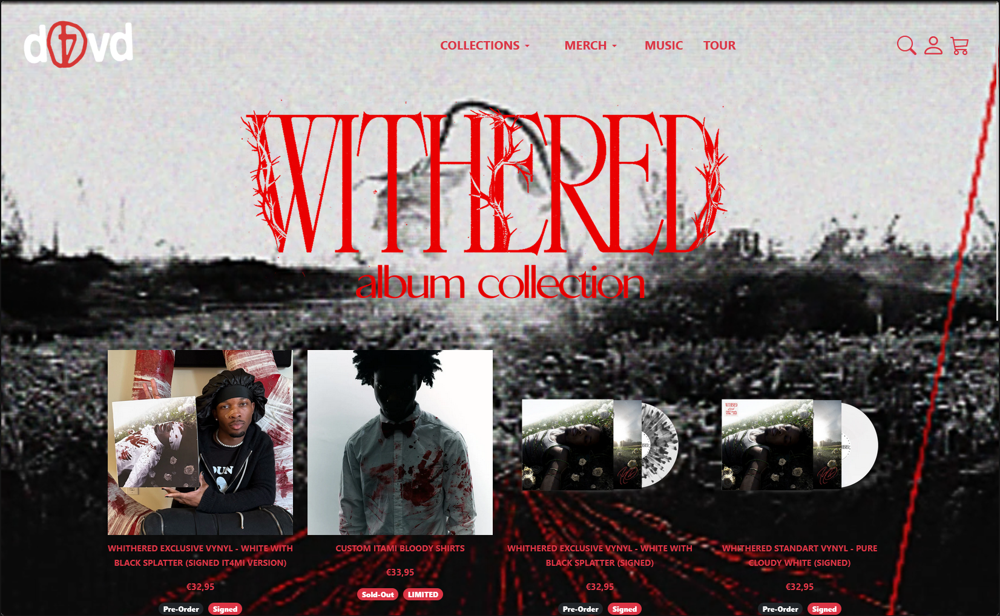

# d4vd Store Clone

 

This is a **replication** of the [d4vd Official Store](https://shop.d4vd.io/) using only **HTML and Bootstrap**. The project aims to mimic the structure and styling of the store while following these constraints:

- **No additional CSS** was used—only Bootstrap utilities.
- **Not a full clone**—only key pages were replicated (e.g., one product page template for all items).
- **Bootstrap colors** were used instead of exact color matches.
- **Default HTML font** was used (no custom fonts).

## Preview




## Features

- Responsive design using Bootstrap's grid system.
- Simple, structured HTML without extra frameworks.
- Minimal but effective layout focusing on store essentials.

## Installation & Usage

1. Clone this repository:
   ```sh
   git clone https://github.com/jiahao04/d4vd-store-clone.git
   ```
2. Open `index.html` in your browser.

## Disclaimer

This project is for **educational purposes only**. It is a personal exercise in web replication and does not aim to infringe on any copyrights.

## Bootstrap Components Explanation

Explanation of every single Bootstrap element used in the creation of this page. [Components Explanation](components-explanation.md)

---

🔗 [Visit the Original Store](https://shop.d4vd.io/)


